# User Journey Document: Collaborative Design Research Platform

## Executive Summary

This platform is a **collaborative design research tool** that combines real-time video conferencing with AI-powered design generation and collaborative code review. Teams can conduct design sessions, discuss ideas, generate code using AI, and collectively review and vote on final designs—all within a structured workflow.

**Key Capabilities:**
- Real-time video conferencing with transcription
- AI-powered meeting summarization
- Collaborative polling and voting
- AI code generation from discussions
- Individual code workspaces
- Collaborative code review and voting
- One-click deployment

---

## System Overview

### What is This Platform?

This is a web-based collaborative design platform built for research teams, design workshops, and collaborative development sessions. It guides users through a structured workflow from initial discussion to final deployment.

### The 5-Stage Workflow

The platform uses a **sequential workflow** with 5 distinct stages:

1. **Meeting Room** - Initial discussion and brainstorming
2. **Workflow Canvas** - Visual navigation hub
3. **Poll/Voting Room** - Summarize and vote on ideas
4. **Coding Mode** - Individual AI-assisted coding
5. **Code Review Room** - Collaborative review and final selection

### Access Model

- **Anyone can join** using a room ID
- **First person to join becomes the Host** with special permissions
- **All participants** can see and contribute
- **Host controls** workflow progression and generates initial designs

---

## User Roles & Permissions

### Host (First User to Join)

**Exclusive Permissions:**
- ✅ Enable/disable workflow stages
- ✅ Generate AI summary from transcripts
- ✅ Add, edit, and delete discussion points
- ✅ Generate initial AI design from summary
- ✅ Edit prompt templates for AI generation
- ✅ Control workflow progression

**Shared Permissions:**
- ✅ Video/audio conferencing
- ✅ Screen sharing
- ✅ Chat and image generation
- ✅ Vote on discussion points
- ✅ Modify their own code workspace
- ✅ Save final versions
- ✅ Vote on final designs

### Participants (All Other Users)

**Permissions:**
- ✅ Join video conference
- ✅ Share screen
- ✅ View and download transcripts
- ✅ Chat and generate images
- ✅ Vote on discussion points (view-only on edits)
- ✅ Code in their own workspace
- ✅ Save final versions
- ✅ Vote and comment on final designs
- ❌ Cannot add/edit discussion points
- ❌ Cannot generate initial AI design
- ❌ Cannot enable/disable workflow stages

---

## Detailed Room-by-Room User Journey

### Room 1: Meeting Room 📹

**Purpose:** Initial discussion, brainstorming, and idea generation with full video conferencing capabilities.

**Route:** `/meet/:roomId`

#### How to Access
1. Enter a room ID (e.g., "design-session-001")
2. System automatically creates a guest account
3. Join the meeting room

#### Key Features

**Video Conferencing:**
- Full video grid showing all participants
- Audio controls (mute/unmute microphone)
- Video controls (turn camera on/off)
- Screen sharing capability
- Built on LiveKit technology

**Live Transcription:**
- Real-time speech-to-text transcription
- Displays in the "Transcript" tab on the right panel
- Shows speaker identification
- Timestamps for each entry
- Auto-saves to database when leaving

**Transcript Actions (All Users):**
- Download transcript as JSON
- Download transcript as TXT
- View transcript history

**Transcript Actions (Host Only):**
- Generate AI summary (moves to Poll room)

**Chat & Image Generation:**
- Switch between "Chat" and "Image Gen" modes
- **Chat Mode:** Text messaging with all participants
- **Image Gen Mode:** Generate images using AI (DALL-E)
- All messages persist and sync in real-time
- Image history is not saved (generate new each time)

**Navigation:**
- Click "🔀 Workflow" button to access workflow canvas

#### User Actions Flow

```
1. Join meeting with room ID
2. Turn on camera and microphone
3. Discuss design ideas (transcribed in real-time)
4. Use chat for text discussion
5. Generate images to share visual concepts
6. Screen share to show references
7. Host generates AI summary when ready
8. Navigate to next stage via workflow button
```

#### What Users See

**Main Area:** Video grid with all participants
**Right Panel (Tabs):**
- 📝 Transcript - Live transcription
- 💬 Chat - Text and image generation

**Bottom Control Bar:**
- Microphone toggle
- Camera toggle
- Screen share toggle
- Leave meeting button
- Workflow navigation button

---

### Room 2: Workflow Canvas 🗺️

**Purpose:** Visual navigation hub for moving between workflow stages.

**Route:** `/meet/:roomId/workflow`

#### How to Access
- Click "🔀 Workflow" button from any room
- Always accessible from all stages

#### Key Features

**Visual Workflow Map:**
- Shows all 5 workflow nodes in a flowchart
- Displays current position
- Shows which stages are unlocked
- Indicates which stages are enabled by host
- Mini-map for overview
- Zoom controls

**The 5 Workflow Nodes:**
1. **Meeting (📹)** - Always accessible, entry point
2. **Poll/Voting (📊)** - Unlocks after visiting Meeting
3. **Coding Mode (💻)** - Unlocks after Meeting + Poll
4. **Code Review (🔍)** - Unlocks after Meeting + Poll + Coding
5. **Exit (🚪)** - Always accessible, leave workflow

**Host Control Panel:**
- Toggle stages on/off
- Control participant access
- View workflow status

**Access Rules:**
- Green nodes: Currently accessible
- Yellow nodes: Visited but not current
- Red nodes: Locked (prerequisites not met)
- Gray nodes: Disabled by host

#### User Actions Flow

```
1. Click workflow button from any room
2. See visual map of all stages
3. Click on an accessible node to navigate
4. [Host only] Enable/disable stages via control panel
5. Navigate to desired stage
```

#### Navigation Logic

Each stage has prerequisites:
- **Meeting:** Always accessible (starting point)
- **Poll:** Requires Meeting to be visited
- **Coding:** Requires Meeting + Poll visited
- **Code Review:** Requires Meeting + Poll + Coding visited
- **Exit:** Always accessible

---

### Room 3: Poll/Voting Room 📊

**Purpose:** Review AI-generated summary, discuss key points, vote on ideas, and generate initial design.

**Route:** `/meet/:roomId/poll`

#### How to Access
- Via workflow canvas
- Automatically unlocks after visiting Meeting room
- Host must enable this stage

#### Key Features

**Two-Tab Interface:**

**Tab 1: AI Summary**
- Displays AI-generated summary of meeting transcript
- Organized by category:
  - ✅ **Decisions** - Agreed-upon choices
  - 📋 **Actions** - Tasks to be done
  - 💬 **Discussions** - Topics discussed
  - ❓ **Questions** - Open questions

**Tab 2: Discussion Points**
- List of discussion points for voting
- Each point shows:
  - Description
  - Category
  - Vote counts (Agree/Disagree/Neutral)
  - Who voted

**Voting System:**
- Click Agree 👍, Disagree 👎, or Neutral 😐
- See real-time vote counts
- Vote counts update live for all users
- Can change vote anytime

**Host-Only Actions:**
- ➕ Add new discussion point
- ✏️ Edit existing points
- 🗑️ Delete points
- 🎨 Generate AI design from summary
- 📝 Edit prompt template
- 📜 View generation history

**AI Design Generation (Host Only):**
1. Click "Generate Design" button
2. Customize prompt template (optional)
3. AI generates initial code/design
4. Creates a new chat in Bolt.DIY
5. Automatically forks design for each user

**Video Presence:**
- Minimized video tile strip at top
- Audio controls still available
- Focus on content review

#### User Actions Flow

**For Participants:**
```
1. Arrive from workflow canvas
2. Read AI-generated summary
3. Review discussion points
4. Vote on each point (Agree/Disagree/Neutral)
5. Wait for host to generate design
6. Navigate to Coding Mode via workflow
```

**For Host:**
```
1. Review AI summary
2. Add/edit/delete discussion points
3. Wait for voting to complete
4. Customize prompt template (optional)
5. Click "Generate Design" button
6. AI creates initial design
7. Design auto-forks for all users
8. Enable Coding Mode stage
9. Navigate to Coding Mode
```

---

### Room 4: Coding Mode 💻

**Purpose:** Individual AI-assisted code development in personal workspaces.

**Route:** `/meet/:roomId/code`

#### How to Access
- Via workflow canvas
- Unlocks after visiting Meeting + Poll rooms
- Host must enable this stage
- Each user gets their own workspace

#### Key Features

**Full Bolt.DIY IDE:**
- Complete AI-powered development environment
- Built-in code editor with syntax highlighting
- Live preview window
- Terminal access
- File browser

**Auto-Fork System:**
- Each user gets a personal copy of the initial design
- Work independently without affecting others
- All changes are private to your workspace

**AI Chat Interface:**
- Chat with AI to modify code
- Ask for specific features
- Request bug fixes
- Get code explanations
- AI generates and applies code changes automatically

**Code Editor:**
- Syntax highlighting
- Multi-file editing
- CodeMirror-based editor
- Auto-save functionality

**Live Preview:**
- Real-time preview of your application
- Updates as code changes
- Full interactive preview
- WebContainer-based sandboxed execution

**Terminal:**
- Run commands
- Install packages
- Execute scripts
- View build logs

**Deployment:**
- Deploy to Netlify directly
- One-click deployment button
- Get live URL for your version

**Final Version Saving:**
- Click "Save as Final Version" button
- Stores your current code state
- Makes it available in Code Review room
- Can update final version multiple times

**Video Presence:**
- Minimized video tile strip at top
- Audio controls available
- Focus on coding

#### User Actions Flow

```
1. Arrive from workflow canvas
2. See initial design in preview
3. Chat with AI to request changes
   Example: "Make the header blue and add a logo"
4. AI generates code modifications
5. See changes in live preview
6. Iterate with more prompts
7. Test functionality in preview
8. When satisfied, click "Save as Final Version"
9. Navigate to Code Review via workflow
```

#### Example Interaction

**User:** "Add a contact form with name, email, and message fields"

**AI Response:**
- Generates React component for form
- Adds styling
- Implements form validation
- Updates preview automatically

**User:** "Make the form submit button green"

**AI Response:**
- Updates button styling
- Preview refreshes instantly

**User:** Clicks "Save as Final Version"
- Current code saved as final submission

---

### Room 5: Code Review Room 🔍

**Purpose:** Collaborative review of all final versions, voting, and discussion.

**Route:** `/meet/:roomId/code-review`

#### How to Access
- Via workflow canvas
- Unlocks after visiting Meeting + Poll + Coding rooms
- Host must enable this stage

#### Key Features

**Left Sidebar: All Final Versions**
- Shows all users who saved final versions
- Displays user names
- Click to view each version
- See vote counts at a glance

**Main Area: Selected Version**
- Full code workbench display
- Interactive preview of the design
- File browser showing all code files
- Can explore code structure

**Voting System:**
- 👍 Like button with comment
- 👎 Dislike button with comment
- Vote counts visible to all
- Can change vote and comment
- Real-time vote synchronization

**Discussion (Per Version):**
- Add comments when voting
- See all feedback
- Threaded discussions
- Real-time updates

**Video Presence:**
- Minimized video tile strip at top
- Audio controls for discussion
- Focus on code review

#### User Actions Flow

```
1. Arrive from workflow canvas
2. See list of all final versions (left sidebar)
3. Click on a version to view
4. Review the code and preview
5. Click Like 👍 or Dislike 👎
6. Add comment explaining vote
7. Move to next version
8. Repeat for all versions
9. Discuss with team via audio
10. Host can finalize one design
11. Deploy final version directly
```

#### Example Review Session

**Reviewing John's Version:**
1. Click "John's Version" in sidebar
2. Preview loads showing his design
3. Browse through code files
4. Notice clean component structure
5. Click 👍 Like
6. Add comment: "Great use of components, very clean code!"

**Reviewing Sarah's Version:**
1. Click "Sarah's Version"
2. Preview loads with different design approach
3. Test interactive features
4. Like the functionality
5. Click 👍 Like
6. Add comment: "Love the user interactions!"

**Final Decision:**
- Team discusses via audio
- Votes tallied
- Host deploys winning version
- Project complete!

---

## Complete User Journey Example

### Scenario: Design Team Creating a Landing Page

**Team Members:**
- Alex (Host) - Team Lead
- Sarah - Designer
- John - Developer
- Maria - Product Manager

### Stage 1: Meeting Room (30 minutes)

**09:00 AM - Session Starts**

```
Alex creates room: "landing-page-redesign"
Sarah, John, and Maria join using the room ID
All turn on cameras and microphones
```

**Discussion:**
- Maria: "We need a modern landing page for our new product"
- Sarah: "I'm thinking clean design, lots of whitespace"
- John: "Should include a hero section, features, and contact form"
- Maria shares screen showing competitor examples
- Team discusses color schemes, layout ideas
- Sarah generates image concepts in the chat
- All discussion transcribed in real-time

**09:30 AM - Alex (Host) generates AI summary**
- Clicks "Generate AI Summary" button
- AI analyzes transcript
- Summary created with key points
- Team transitions to Poll room

### Stage 2: Workflow Canvas (2 minutes)

**09:32 AM**
- Alex clicks "🔀 Workflow" button
- Everyone sees visual workflow map
- Alex enables "Poll/Voting" stage
- Team clicks on Poll node to navigate

### Stage 3: Poll Room (15 minutes)

**09:34 AM - Reviewing Summary**

**AI Summary Shows:**
- ✅ **Decision:** Modern, clean design with whitespace
- ✅ **Decision:** Include hero, features, contact sections
- 📋 **Action:** Use blue and white color scheme
- 💬 **Discussion:** Mobile-first approach
- ❓ **Question:** Should we include testimonials?

**Voting:**
- Sarah adds discussion point: "Add testimonials section"
  - Votes: 3 Agree, 1 Neutral
- John adds: "Include pricing table"
  - Votes: 2 Agree, 2 Disagree
- Team discusses via audio

**09:45 AM - Alex generates design**
- Edits prompt template to emphasize modern design
- Clicks "Generate Design" button
- AI creates initial React landing page
- Design automatically forked for all 4 users
- Alex enables "Coding Mode" stage

**09:49 AM - Navigate to Coding**
- Click workflow button
- Click Coding Mode node

### Stage 4: Coding Mode (45 minutes)

**Each team member works independently:**

**Sarah's Workspace:**
```
Sarah: "Make the hero section gradient background from blue to purple"
AI: [Generates gradient CSS]
Sarah: "Add a subtle animation to the hero title"
AI: [Adds CSS animation]
Sarah: "Save as Final Version" ✓
```

**John's Workspace:**
```
John: "Add a testimonials carousel with 3 slides"
AI: [Creates carousel component]
John: "Make the features section use cards with icons"
AI: [Implements card layout]
John: "Add smooth scroll behavior"
AI: [Adds smooth scrolling]
John: "Save as Final Version" ✓
```

**Maria's Workspace:**
```
Maria: "Add a pricing table with 3 tiers"
AI: [Creates pricing component]
Maria: "Make the contact form send to our email"
AI: [Implements form handling]
Maria: "Save as Final Version" ✓
```

**Alex's Workspace:**
```
Alex: "Combine elements: gradient hero, testimonials, pricing"
AI: [Integrates all features]
Alex: "Optimize for mobile responsiveness"
AI: [Adds responsive design]
Alex: "Save as Final Version" ✓
```

**10:34 AM - All versions saved**
- Alex enables "Code Review" stage
- Team navigates via workflow canvas

### Stage 5: Code Review (30 minutes)

**10:36 AM - Review Session**

**Reviewing Sarah's Version:**
- Beautiful gradient and animations
- Missing testimonials and pricing
- Votes: 2 👍, 2 👎
- Comments: "Love the design but too minimal"

**Reviewing John's Version:**
- Great testimonials carousel
- Nice feature cards
- Missing pricing
- Votes: 3 👍, 1 😐
- Comments: "Solid features, needs pricing table"

**Reviewing Maria's Version:**
- Excellent pricing table
- Good contact form
- Less polished design
- Votes: 2 👍, 2 😐
- Comments: "Great functionality, needs design polish"

**Reviewing Alex's Version:**
- Combines best elements
- Gradient hero from Sarah's
- Testimonials from John's
- Pricing from Maria's
- Fully responsive
- Votes: 4 👍, 0 👎
- Comments:
  - "Perfect combination!"
  - "This is the winner!"
  - "Has everything we need"
  - "Ready to deploy"

**11:00 AM - Final Decision**
- Team agrees on Alex's version
- Alex clicks "Deploy" button
- Site deploys to Netlify
- Live URL: `https://landing-redesign-xyz.netlify.app`
- **Project Complete! 🎉**

### Summary Statistics

- **Total Time:** 2 hours
- **Participants:** 4
- **Versions Created:** 4
- **Final Deployment:** 1
- **Total Votes Cast:** 14
- **Discussion Points:** 6

---

## Mermaid Diagrams

### Diagram 1: Overall Workflow

```mermaid
graph LR
    A[Join Meeting] --> B[Meeting Room 📹]
    B --> C[Workflow Canvas 🗺️]
    C --> D[Poll/Voting Room 📊]
    D --> C
    C --> E[Coding Mode 💻]
    E --> C
    C --> F[Code Review Room 🔍]
    F --> C
    C --> G[Exit 🚪]

    style A fill:#e1f5ff
    style B fill:#fff4e1
    style C fill:#f0e1ff
    style D fill:#e1ffe1
    style E fill:#ffe1e1
    style F fill:#ffe1f5
    style G fill:#e1e1e1
```




### Diagram 2: Detailed User Journey Flow


### Diagram 3: Room Navigation Map


### Diagram 4: Data Flow - Transcript to Deployment


### Diagram 5: User Roles & Permissions


### Diagram 6: Workflow Access Control State


---

## HCI Analysis

### Information Architecture

```
Level 1: Meeting Session (Room ID)
│
├─ Level 2: Workflow Stages
│  │
│  ├─ Meeting Room
│  │  ├─ Video Grid
│  │  ├─ Control Bar
│  │  └─ Side Panel
│  │     ├─ Transcript Tab
│  │     └─ Chat Tab
│  │
│  ├─ Workflow Canvas
│  │  ├─ Visual Node Map
│  │  ├─ Mini-map
│  │  └─ Host Controls
│  │
│  ├─ Poll Room
│  │  ├─ Summary Tab
│  │  ├─ Discussion Tab
│  │  └─ Video Strip
│  │
│  ├─ Coding Mode
│  │  ├─ Chat Panel
│  │  ├─ Editor Panel
│  │  ├─ Preview Panel
│  │  ├─ Terminal
│  │  └─ Video Strip
│  │
│  └─ Code Review
│     ├─ Version Sidebar
│     ├─ Code Workbench
│     └─ Video Strip
│
└─ Level 3: Persistent Elements
   ├─ User Authentication
   ├─ Workflow State
   └─ Real-time Sync
```
---

**Acronyms:**

- **AI** - Artificial Intelligence
- **HCI** - Human-Computer Interaction
- **IDE** - Integrated Development Environment
- **UI** - User Interface
- **URL** - Uniform Resource Locator
- **RTC** - Real-Time Communication

---